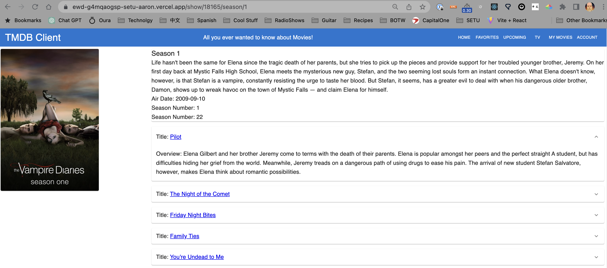

# Enterprise Web Development - Assignment 1.

__Name:__ Aaron O'Brien

## Overview.

Below is a list of features implemented to the Movies Application

Noticeable Changes on the UI
+ Pagination - Pagination is supported on Discover Movies, Upcoming Movies, TV
+ Added Cast and Crew for Movies 
+ Added a new View to see the Actors Details
+ Added a Dicoverable TV Shows
+ Added a way to mark TV Shows as favorites
+ Added TV Shows to the Favorites View
+ Added TV Show Details
+ TV Show has a Clickable and Accordian view of Seasons
+ Added Season Details Season details that has an according view of season episodes
+ Added Episode Details with a Guest Star, and Crew view
+ Added an Account section allowing a user to login, logout and manage their account details.
+ Added a My Movies View
+ Added a way to create "My Movies" 
+ Added a "My Movie Details" page

Changes invisible to the UI
+ Integrated with supabase for authentication
+ Storing Favorite shows, movies in supabase
+ Storing Custom Movies to supabase
+ Deployed application to Vercel visilbe here [https://ewd-g4mqaogsp-setu-aaron.vercel.app/](https://ewd-g4mqaogsp-setu-aaron.vercel.app/)
+ Protected URL's to make sure logged in users can only do certain things.

## Feature Design.

[ For each feature listed in the overview, show a screenshot(s) of its UI layout (use appropriate magnification for accessibility). Include captions with the images.]
#### Added Cast and Crew for Movies 

#### Added a new View to see the Actors Details

#### Added a Dicoverable TV Shows

#### Added a way to mark TV Shows as favorites

#### Added TV Shows to the Favorites View

#### Added TV Show Details

#### TV Show has a Clickable and Accordian view of Seasons

#### Added Season Details Season details that has an according view of season episodes

#### Added Episode Details with a Guest Star, and Crew view

#### Added an Account section allowing a user to login, logout and manage their account details.


#### Added a My Movies View
#### Added a way to create "My Movies" 
#### Added a "My Movie Details" page

e.g. 

#### The Upcoming Movies feature.

> Lists movies from the Upcoming movies endpoint of TMDB

![][image1]

#### Movies Reviews feature.

> Lists all the reviews for a particular movie (text extract only).

![][image2]

> Click the 'Full Review' link of an entry in the above list to show the full text of a review. 

![][image3]

.... other features .......

## Storybook.

[ Include a screenshot(s) from the Storybook UI and highlight the stories for new components developed.]

e.g.

![][image5]

## Authentication.

[ List all the routes in your app and highlight those that are protected/private (require authentication).]

e.g.

+ /movies - List of 20  movies from the Discover endpoint,
+ /movies/{movie_id} - Detailed information on a specific movie.
+ /reviews/{review_id} (Protected) - The full text of a movie review.
+ /movie/{movie_id}/similar - A list of similar movies. 
+ /person/{person_id} (Protected) - A specific actor's bio.
+ etc
+ etc

#### Protected features (if relevant)

[ Briefly state other areas where you used authentication in the app, for example, to protect access to functionality, e.g. only authenticated users can 'favourite' a movie.]

#### Supabase (if relevant)

[ Include a screenshot(s) from your Supabase account that verifies its use for this app. ]

## Deployment (if relevant).

[ Specify the URL of your deployed app and include a screenshot(s) from your deployment platform (e.g. Vercal) account that verifies its use for this app. Have a preregistered user for your app and specify their credentials.

Username: test1 ; Password: pass1
]

## Persistence (if relevant).

[ If you are persisting data to the Supabase backend, e.g. favourite movies, fantasy movie, include screenshots with appropriate captions to verify this aspect. ]

## Additional Information.

[ Briefly explain any other aspects of your app's design or implementation that is non-standard and worthy of mention.]

[image1]: ./images/image1.png
[image2]: ./images/image2.png
[image3]: ./images/image3.png
[image4]: ./images/image4.png
[image5]: ./images/image5.png


## Movies Lab Project
This project came from a zip file
It uses storybook for component development and was created using [vitie](https://vitejs.dev/)

## Create a project with vitejs
```
 npm create vite@latest
 ```
 Here are some interesting [Vite Templates](https://github.com/vitejs/awesome-vite#templates) these are not used for this project.

 ## Run this project
 ```
 npm run dev
 ```

 ## Adding StoryBook
 (StoryBook)[https://storybook.js.org/] can be added to a new project with this command:
 ```
 npm install @storybook/builder-vite --save-dev
 ```

## The Movie Database Integration
[TMDB](https://www.themoviedb.org/?language=en-US) is used to develop this project.  The API_KEY can be found in the .env file, if you are checking this out fresh you will need your own api key and create the .env vile in the project root it should look like this:
```
VITE_TMDB_KEY=<apikey from tmbd>
```

April 10th Deployed to vercel